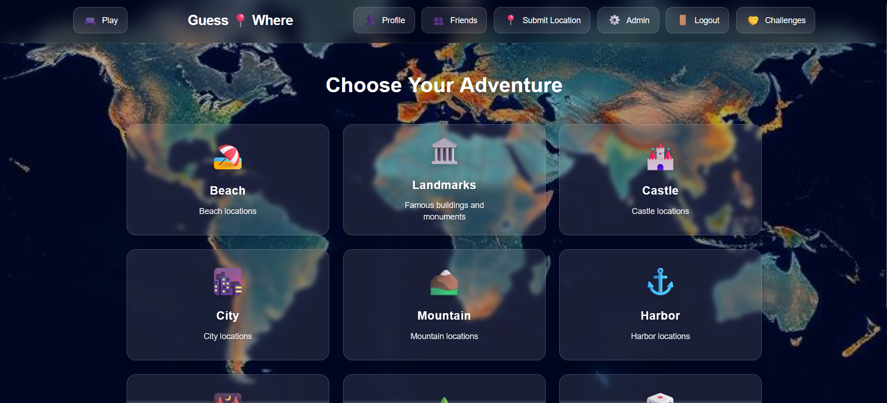
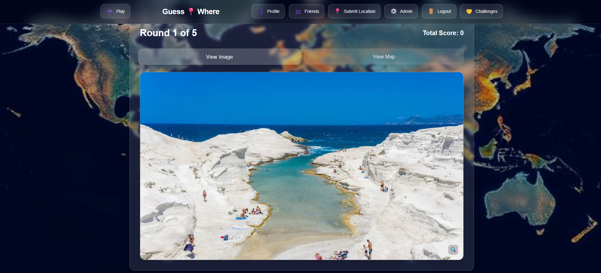
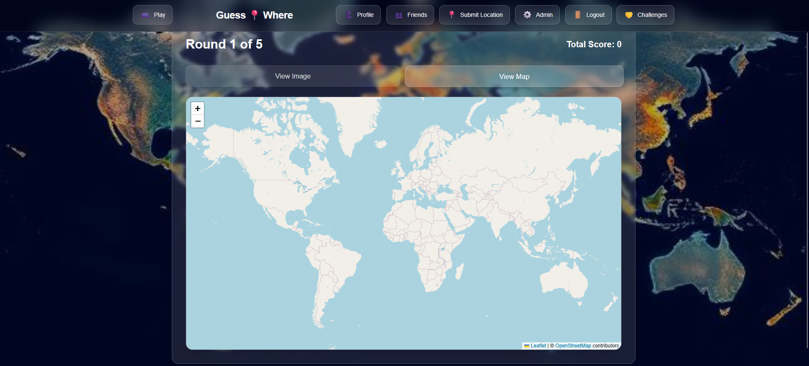

# 🌍 GuessWhere

**GuessWhere** is a geography-based web game where players try to guess the location of a photo on a world map. The closer your guess is to the actual location, the higher your score.

---

## 🎮 Features

- 🌐 Interactive map-based guessing game
- 🖼️ Users can submit new location photos
- 🛂 Admin dashboard to approve submitted locations
- 🧾 Scoring system based on distance from the correct location
- 📱 Responsive design for desktop (mobile not tested)
- 🔐 User authentication with:
  - Email verification
  - Password reset via email
- 🧑‍💻 Built from scratch using modern web technologies

---

## ⚙️ Tech Stack

- **Frontend:** React
- **Backend:** FastAPI (Python)
- **Database:** PostgreSQL
- **Map:** Leaflet.js + OpenStreetMap
- **Auth:** Custom auth system with email verification
- **Deployment:** AWS EC2 (t3.micro), Nginx, Supervisor (no longer online)

---

## Screenshots

### Landing Page


_The welcoming landing page of GuessWhere, featuring the game's main interface and navigation options._

### In-Game View


_The main gameplay interface where users can view and guess locations._

### Game Map


_The interactive map interface where players can place their location guesses._

---

## 🚀 Getting Started

### Clone the repository

```bash
git clone https://github.com/RobMal123/webramverk-projekt.git
cd guesswhere
```
